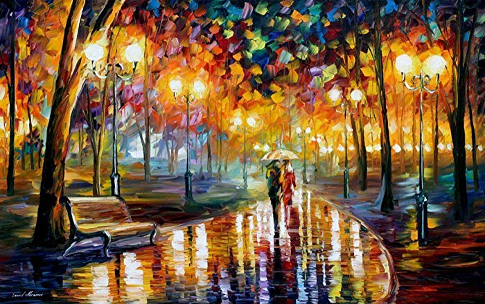
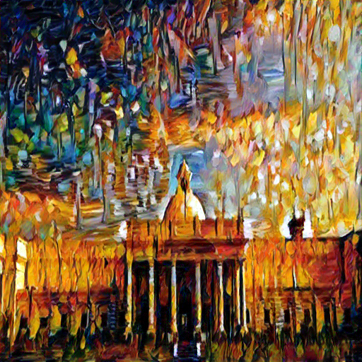

# Image Style Transfer Using Convolutional Neural Networks in PyTorch

This repository contains code of the paper [Image Style Transfer Using Convolutional Neural Networks](http://www.f.waseda.jp/hfs/SimoSerraSIGGRAPH2016.pdf) which is tested and trained on cutom datasets. It is based on PyTorch.

## Overview

The paper argues that the feature maps in the deeper hidden layers contain rich information about the content of the image. Also, it was established that the style information contained in the image can be extracted from the correlation of the feature maps of the first convolutional layers in the various conv-stacks present in the network.

In this paper, style transfer uses the features found in the 19-layer VGG Network, which is comprised of a series of convolutional and pooling layers, and a few fully-connected layers. In the image below, the convolutional layers are named by stack and their order in the stack. Conv_1_1 is the first convolutional layer that an image is passed through, in the first stack. Conv_2_1 is the first convolutional layer in the second stack. The deepest convolutional layer in the network is conv_5_4.


Style transfer relies on separating the content and style of an image. Given one content image and one style image, we aim to create a new, target image which should contain our desired content and style components:

- objects and their arrangement are similar to that of the **content image**
- style, colors, and textures are similar to that of the **style image**

#### Content Loss
The content loss will be the mean squared difference between the target and content features at layer conv4_2.

#### Style Loss
The style loss is calculated in a similar way, only iterated through a number of layers,

#### Total Loss
Finally, total loss is created by adding up the style and content losses and weighting them with your specified alpha and beta


## Contents
- [Image Style Transfer Using Convolutional Neural Networks in PyTorch](#Image-Style-Transfer-Using-Convolutional-Neural-Networks-in-PyTorch)
  - [Overview](#Overview)
      - [Content Loss](#Content-Loss)
      - [Style Loss](#Style-Loss)
      - [Total Loss](#Total-Loss)
  - [Contents](#Contents)
  - [1. Setup Instructions and Dependencies](#1-Setup-Instructions-and-Dependencies)
  - [2. Dataset](#2-Dataset)
  - [3. Training the model](#3-Training-the-model)
  - [4. Observations](#4-Observations)
    - [Input Images](#Input-Images)
    - [Final Image](#Final-Image)
  - [5. Repository overview](#5-Repository-overview)


## 1. Setup Instructions and Dependencies

Clone the repositiory on your local machine.

``` Batchfile
git clone https://github.com/ishanrai05/style-transfer
```

Start a virtual environment using python3
``` Batchfile
virtualenv env
```


Install the dependencies
``` Batchfile
pip install -r requirements.txt
```

You can also use google collab notebook. In that case just upload the notebook provided in the repository and you are good to go.


## 2. Dataset

I have used 

## 3. Training the model

To train the model, run

```Batchfile
python main.py --train=True
```

optional arguments:
  | argument | default | desciption|
  | --- | --- | --- |
  | -h, --help | | show help message and exit |
  | --use_cuda | False | device to train on. default is CPU |
  | --show_img | False | See sample images |
  | --num_epochs | 5 | Number of epochs to train on |
  | --train | True | train the model |
  | --content_path | 'images/content/main-building.jpg' | path to content |
  | --style_path | 'images/style/starry-night.jpg' | path to style |
  | --content_weight | 1 | content weight: alpha |
  | --style_weight | 1e6 | style weight: beta |
  | --show_every | 200 | displaying the target image, intermittently |
  | --steps | 2000 | iterations to update image |


## 4. Observations

The modal takes about 63 mins to train for 150 epochs on Google Collab with Nvidia Tesla K80 GPU.

### Input Images

I have used RAIN'S RUSTLE IN THE PARK by Leonid Afremov for style image


and the picture of my college: IIT Roorkee as content image


### Final Image



## 5. Repository overview


This repository contains the following files and folders

1. **notebook**: This folder contains the jupyter notebook for code.

2. **images**: Contains images.

3. `utils.py`: Contains helper functions.

4. `train.py`: function to train models from scratch.

5. `main.py`: contains main code to run the model.

6. `requirements.txt`: Lists dependencies for easy setup in virtual environments.

